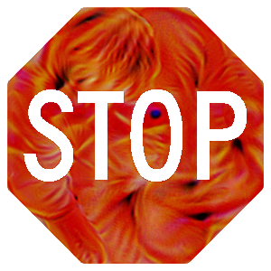
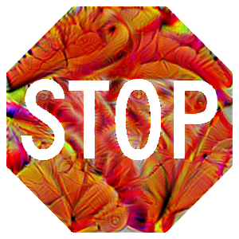
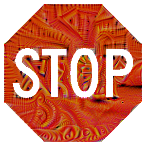
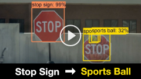

## Overview

This is the code repository for the ECML-PKDD 2018 paper: **ShapeShifter: Robust Physical Adversarial Attack on Faster R-CNN Object Detector**

The arXiv version is available at https://arxiv.org/abs/1804.05810

The code included here reproduces our techniques presented in the paper.

In this work, we tackle the more challenging problem of crafting physical adversarial perturbations to fool image-based object detectors like Faster R-CNN.
Attacking an object detector is more difficult than attacking an image classifier, as it needs to mislead the classification results in multiple bounding boxes with different scales.
Our approach can generate perturbed stop signs that are consistently mis-detected by Faster R-CNN as other objects, posing a potential threat to autonomous vehicles and other safety-critical computer vision systems.


## Install Dependencies

This repository depends on Tensorflow Object Detection API.
Follow the installation instructions at https://github.com/tensorflow/models/blob/master/research/object_detection/g3doc/installation.md

## How to Run the Code
Using google colab : https://colab.research.google.com/drive/1jwM8oeVPSjRqlj_gfnylJhmro-Z4Xsb_?usp=sharing
---
:new:

Alternatively, you can use our `shapeshifter2d.py` and `shapeshifter3d.py` scripts to generate shapeshifter-style perturbations. We currently have examples for various shapeshifter-style perturbations in the `Makefile`:
```
$ make

Usage:
  make <target>
  help                                  Display this help

Dependencies
  deps                                  Install dependencies, compile protobufs, and patch projects.

Helpers
  tensorboard                           Launch tensorboard to monitor progress.

Attacks
  2d_stopsign_targeted_attack           Create 2d stop sign that is detected as a person.
  2d_stopsign_untargeted_attack         Create 2d stop sign that is not detected as a stop sign.
  2d_stopsign_proposal_attack           Create 2d stop sign that is not detected.
  2d_stopsign_hybrid_targeted_attack    Create 2d stop sign that is either not detected at all or detected as a person.
  2d_stopsign_hybrid_untargeted_attack  Create 2d stop sign that is either not detected at all or not detected as a stop sign.
  2d_person_proposal_attack             Create 2d tshirt that is not detected.
  2d_person_targeted_attack             Create 2d tshirt that is detected as a bird.
  2d_person_untargeted                  Create 2d tshirt that is not detected as a person.
  2d_person_hybrid_untargeted           Create 2d tshirt that is either not detected at all or not detected as a person.
  2d_person_hybrid_targeted             Create 2d tshirt that is either not detected or is detected as a bird.
  3d_person_targeted_attack             Create 3d outfit that is detected as a bird.
  3d_person_untargeted_attack           Create 3d outfit that is not detected as a person.
  3d_person_proposal_attack             Create 3d outfit that is not detected.
  3d_person_hybrid_targeted_attack      Create 3d outfit that is either not detected at all or detected as a bird.
  3d_person_hybrid_untargeted_attack    Create 3d outfit that is either not detected at all or not detected as a person.
```

For these to work, you will have to first install our dependencies and patches via:
```
make deps
```
This will create a Python 3.6 virtual environment, install dependencies via [Pipenv](https://pipenv.kennethreitz.org/en/latest/) (we assume Pipenv is already installed), compile protobufs in the [Object Detection API](https://github.com/tensorflow/models/tree/master/research/object_detection), and apply our patches to the [Object Detection API](https://github.com/tensorflow/models/tree/master/research/object_detection) and [Lucid](https://github.com/tensorflow/lucid) dependencies.

You can watch the progress of the perturbation generation via:
```
make tensorboard
```
Navigate your browser to the printed url to see the Tensorboard output.

You can also see example outputs from these scripts in the pictures section below.

We have also released our 3D ShapeShifter pedestrian models that we showcased in our [recent talk at DSML'19](https://arxiv.org/abs/1904.12622). However, we are unable to distribute the meshes and textures we extracted from CARLA as this time.

## Pictures of Targeted and Untargeted Attacks
### Targeted (Person) Perturbation
We used `make 2d_stopsign_targeted_attack` to create this perturbation.



### Untargeted Perturbation
We used `make 2d_stopsign_untargeted_attack` to create this perturbation.



### Proposal Attack
We used `make 2d_stopsign_proposal_attack` to create this perturbation.



## Videos of Targeted and Untargeted Attacks

### High-confidence Person Perturbation:
https://youtu.be/pc2ssNY98LA

[](https://youtu.be/pc2ssNY98LA)

Transferability Experiments: https://youtu.be/O3w00VI4hl0

### High-confidence Sports Ball Perturbation:
https://youtu.be/qHFjYWDUW3U

[](https://youtu.be/qHFjYWDUW3U)

Transferability Experiments: https://youtu.be/yqTVVfnsjxI

### High-confidence Untargeted Attack:
https://youtu.be/906DxYYj_JE

[](https://youtu.be/906DxYYj_JE)

Transferability Experiments: https://youtu.be/4KFhULX3v58


Snapshots of the drive-by test results. In (a), the person perturbation was detected 38% of the frames as a person and only once as a stop sign. The perturbation in (b) was detected 11% of the time as a sports ball and never as a stop sign. The untargeted perturbation in (c) was never detected as a stop sign or anything else.


## Researchers

|  Name                 | Affiliation                     |
|-----------------------|---------------------------------|
| Shang-Tse Chen        | Georgia Institute of Technology |
| Cory Cornelius        | Intel Corporation               |
| Jason Martin          | Intel Corporation               |
| Polo Chau             | Georgia Institute of Technology |
